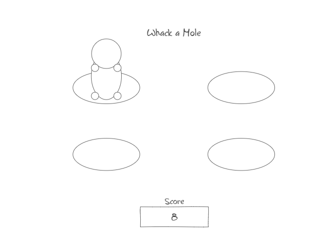

# Whack-A-Mole
## Description deliverable
### Elevator Pitch 
Are you tired of boring, everyday life? Do you perhaps need something to make your life a little more exciting? Imagine a never ending, fast-paced game that lets you show off your skills to your friends. Allow me to introduce you to Whack-A-Mole. In this game, you must "whack" every mole as it shows up. However, you must be quick! If you fail to hit the mole quickly, it will go away and you will lose. This is a perfect game for anyone, young or old!

Disclaimer: No actual moles were harmed in the making of this game.

### Design

### Key Features
* Secure login over HTTPS
* Ability to click on a button to start a game
* Detect loss conditions, the game ends when loss is detected
* Click on the mole when the mole is up, adding to the score
* Ability to keep score and calculate high score for each player
* A leaderboard of the highest scores out of all the players
* High scores are persistently stored for each player

### Technologies
* **HTML** - Use HTML to provide the structure for the application. There will be 3 HTML pages: one for login, one for the game, and one to see the scores.
* **CSS** - Use CSS to provide styling for the application on different screen sizes. I will use good whitespace, 
* **JavaScript** - Use JavaScript to log in, start and play the game, keep score, and to end the game. 
* **Service** - Backend service with endpoints for:
  * Login
  * Operating the game (starting and ending the game)
  * Keeping score
  * Retrieving high scores
* **Database** - The database will store users and high scores.
* **Login** - Registering and logging in users. You cannot play without logging in.
* **WebSocket** - This will broadcast a leaderboard of the top 5 high scores from every user.
* **React** - The application will use the React framework.

## Notes
https://github.com/camilv12/startup/blob/main/notes.md
